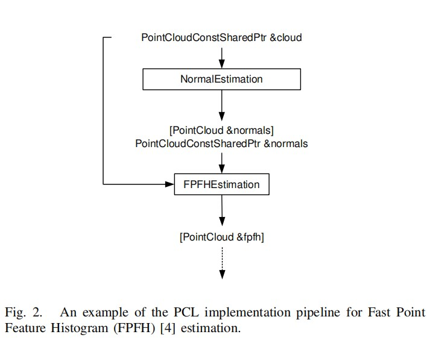

# PCL介绍
PCL是一个c++库，用于处理3D point <br>
PCL提供eigen库用于矩阵计算 <br>
PCL提供OpenMP库和TBB（threading building blocks线程块）库用于多核并行 <br>
PCL提供FLANN库来做快速的k近邻计算 <br>
<br>
PCL中的boost共享指针：用于传输各个模块和算法数据 <br>
PCL中对3D点云的处理包括：滤波，特征估计，表面重构，模型拟合，点云分割，三维重构等 <br>
<br>
<br>
**PCL的使用流程：** <br>
1.创建processing对象（滤波，特征估计，点云分割）<br>
2.使用setInputCloud将输入的点云数据传到module中 <br>
3.调参 <br>
4.计算得到输出 <br>
5.将原始输入和计算的结果一起传输到FPFH估计对象中 <br>

<br>
**PCL的各个库以及作用：** <br>
1. libpcl_filters: 对数据进行过滤，例如下采样，去除离群点，标记提取 <br>
2. libpcl_features:  计算三维特征例如计算表面的法线，曲率，边界点估计，moment不变，主曲率，PPFH和FPFH描述，自旋图片，积分图片，NARF描述，RIFT，RSD，VFH，SIFT等 <br>
3. libpcl_io: 实现输入输出操作 <br>
4. lib_segmentation: 实现聚类提取，通过简单的通用方法来拟合模型，多边形棱镜提取 <br>
5. libpcl_surface: 包含实现三维表面重构所需要的各种算法，例如网格划分，凸体壳，移动最小二乘等 <br>
6. libpcl_registration: 包含实现三维点云重构所需要的各种算法，例如ICP等 <br>
7. libpcl_keypoints: 包含实现各种关键点提取方法，关键点是用于提取特征前的预处理部分 <br>
8. libpcl_range_image: 实现了对从点云数据集创建的范围图像的支持  <br>
<br>

**PCL和ROS：**  <br>
perception processing graph（PPG）：感知图像处理 <br>
1. ROS：是最近的三维视觉处理库 <br>
2. PCL：基于ROS库中获得的经验，PCL中的每个算法都以独立构建的模块提供，每个模块都创建一个procssing graphs，这就想ROS系统中一个一个连接起来的节点。 <br>
3. nodelets：是PCL中动态可加载的插件，操作起来类似ROS中的节点，作用是避免不必要数据的复制或序列化/反序列化。 <br>
<br>

**PCL的可视化**  
PCL的点云可视化是基于VTK。VTK为渲染三维点云和表面数据提供了强大的多平台支持，包括对张量、纹理和体积方法的可视化支持。 <br>
<br>

**PCL的可视化库可以提供以下功能**  
1. 为n维数据提供渲染方法 <br>
2. 提供绘制基本三维形状的方法 <br>
3. 为2维图提供histogram visualization module <br>
4. 提供大量的几何图形和颜色处理程序。 <br>
5. 提供rangeimage 可视化模块。 <br>
 <br>
 
**PCL的使用实例**  
1. 导航和建图 <br>
2. 目标物识别 <br>
3. 操作和抓取 <br>

# Linux安装PCL  
**环境**Oracle VM VirtualBox下安装ubuntu
**PCL官网下载地址**
https://pointclouds.org/downloads/  
**PCL官网Linux下安装教程**
https://pcl.readthedocs.io/projects/tutorials/en/master/compiling_pcl_posix.html#compiling-pcl-posix  
```git
git clone https://github.com/PointCloudLibrary/pcl.git
cd pcl
mkdir build
cd build
cmake ..
cmake -DCMAKE_BUILD_TYPE=Release ..
make -j2
make -j2 install
```
如果cmake ..失败，是因为还需要下载依赖库
```git
sudo apt install git cmake libboost-all-dev libeigen3-dev libflann-dev libvtk7-dev libqhull-dev
```
如果安装libvtk7-dev出现下列错误时，安装libvtk7-jni即可
```git
$ sudo apt install libvtk7-dev
Reading package lists... Done
......
The following packages have unmet dependencies:
 libvtk7-dev : Depends: libvtk7-java (= 7.1.1+dfsg1-2) but it is not going to be installed
E: Unable to correct problems, you have held broken packages.

$ sudo apt install libvtk7-java
Reading package lists... Done
Building dependency tree
Reading state information... Done
... ...
The following packages have unmet dependencies:
 libvtk7-java : Depends: libvtk7-jni (= 7.1.1+dfsg1-2) but it is not going to be installed
E: Unable to correct problems, you have held broken packages.

$ sudo apt install libvtk7-jni
Reading package lists... Done
Building dependency tree
Reading state information... Done
The following additional packages will be installed:
  libqt5x11extras5 libvtk7.1 libvtk7.1-qt
Suggested packages:
  vtk7-doc vtk7-examples
The following packages will be REMOVED:
  libpcl-dev libvtk6-dev libvtk6-java libvtk6-jni libvtk6-qt-dev
The following NEW packages will be installed:
  libqt5x11extras5 libvtk7-jni libvtk7.1 libvtk7.1-qt
0 upgraded, 4 newly installed, 5 to remove and 0 not upgraded.
Need to get 38.6 MB of archives.
After this operation, 127 MB of additional disk space will be used.
Do you want to continue? [Y/n] y
......
Setting up libvtk7-jni (7.1.1+dfsg1-2) ...
Processing triggers for libc-bin (2.27-3ubuntu1.4) ...
```

# Linux下使用PCL
**教程地址**  
https://pcl.readthedocs.io/projects/tutorials/en/latest/  
**使用Binaries**  
下载官网数据https://github.com/PointCloudLibrary/data  
1. 使用pcl_viewer查看.pcd文件
```git
pcl_viewer xxxx.pcd
```
2. pcl_pcd_convert_NaN_nan：将pcd中的NaN值转为nan
```git
pcl_pcd_convert_NaN_nan input.pcd output.pcd
```
3. pcl_convert_pcd_ascii_binary:将pcd文件从ASCII码转为二进制文件或者二进制压缩文件
```git
pcl_convert_pcd_ascii_binary <file_in.pcd> <file_out.pcd> 0/1/2 (ascii/binary/binary_compressed) [precision (ASCII)]
```
4. pcl_concatenate_points_pcd ： 将两个或多个PCD文件的点放到到单个PCD文件中
```git
pcl_concatenate_points_pcd <filename 1..N.pcd>
```   
5. pcl_pcd2vtk： 将pcd文件转为vtk文件
```git
pcl_pcd2vtk input.pcd output.vtk
```
6. pcl_pcd2ply： 将pcd文件转为ply文件
```git
pcl_pcd2ply input.pcd output.ply
```
7. pcl_mesh2pcd ：将CAD文件转为pcd文件
8. pcl_octree_viewer：可视化octree
```git
octree_viewer <file_name.pcd> <octree resolution>
```
**PCL中的基础数据结构**   
1. width : width*height=point的个数
2. height ：height=1表示point cloud为无组织的
3. points ：pcl::PointCloud<pcl::PointXYZ>数据类型等价于std::vector<pcl::PointXYZ>
```git
pcl::PointCloud<pcl::PointXYZ> cloud;
std::vector<pcl::PointXYZ> data = cloud.points;
``` 
4. is_dense : 当point的值为非nan时is_dense=true，当point的值为nan时is_dense=false
5. sensor_origin_ : sensor的平移信息
6. sensor_orientation : sensor的旋转信息

**在c++项目中使用pcl**
1. 在某一文件夹例如project文件夹下新建一个pcd_write_test.cpp文件，并将下列内容复制到pcd_write_test.cpp文件中
```git
#include <iostream>
#include <pcl/io/pcd_io.h>
#include <pcl/point_types.h>

int
  main ()
{
  pcl::PointCloud<pcl::PointXYZ> cloud;

  // Fill in the cloud data
  cloud.width    = 5;
  cloud.height   = 1;
  cloud.is_dense = false;
  cloud.resize (cloud.width * cloud.height);

  for (auto& point: cloud)
  {
    point.x = 1024 * rand () / (RAND_MAX + 1.0f);
    point.y = 1024 * rand () / (RAND_MAX + 1.0f);
    point.z = 1024 * rand () / (RAND_MAX + 1.0f);
  }

  pcl::io::savePCDFileASCII ("test_pcd.pcd", cloud);
  std::cerr << "Saved " << cloud.size () << " data points to test_pcd.pcd." << std::endl;

  for (const auto& point: cloud)
    std::cerr << "    " << point.x << " " << point.y << " " << point.z << std::endl;

  return (0);
}
```
2. 在和pcd_write_test.cpp同级目录下创建CMakelists.txt，并将下列内容复制到CMakelists.txt中
```git
cmake_minimum_required(VERSION 3.5 FATAL_ERROR)
project(pcd_write)
find_package(PCL 1.2 REQUIRED)
include_directories(${PCL_INCLUDE_DIRS})
link_directories(${PCL_LIBRARY_DIRS})
add_definitions(${PCL_DEFINITIONS})
add_executable(pcd_write pcd_write.cpp)
target_link_libraries(pcd_write ${PCL_LIBRARIES})
```
cmake_minimum_required(VERSION 3.5 FATAL_ERROR) ：cmake的版本不能低于3.5 否则报错  
project(pcd_write) ：最终生成的可执行文件叫pcd_write  
find_package(PCL 1.2 REQUIRED) ：PCL的版本不能低于1.2，REQUIRED表示需求PCL中的所有内容  
include_directories(${PCL_INCLUDE_DIRS}) ： 
link_directories(${PCL_LIBRARY_DIRS}) ：  
add_definitions(${PCL_DEFINITIONS}) ：  
add_executable(pcd_write pcd_write.cpp) ：告知cmake从pcd_write.cpp中创建可执行文件，cmake将负责后缀（在Windows平台上为.exe，在UNIX上为空白） 
target_link_libraries(pcd_write_test ${PCL_LIBRARIES}) ：让链接器知道我们链接的库  
3. 还是在和pcd_write_test.cpp同级目录下打开命令行，按下列命令输入命令
```git
$ cd /PATH/TO/MY/GRAND/PROJECT
$ mkdir build
$ cd build
$ cmake ..
$ make
$ ./pcd_write_test
```   
**利用pcl做矩阵变换**  
1. 在某一文件夹例如project文件夹下新建一个pcd_write_test.cpp文件，并将下列内容复制到pcd_write_test.cpp文件中
```git
#include <iostream>

#include <pcl/io/pcd_io.h>
#include <pcl/io/ply_io.h>
#include <pcl/point_cloud.h>
#include <pcl/console/parse.h>
#include <pcl/common/transforms.h>
#include <pcl/visualization/pcl_visualizer.h>

// This function displays the help
void
showHelp(char * program_name)
{
  std::cout << std::endl;
  std::cout << "Usage: " << program_name << " cloud_filename.[pcd|ply]" << std::endl;
  std::cout << "-h:  Show this help." << std::endl;
}

// This is the main function
int
main (int argc, char** argv)
{

  // Show help
  if (pcl::console::find_switch (argc, argv, "-h") || pcl::console::find_switch (argc, argv, "--help")) {
    showHelp (argv[0]);
    return 0;
  }

  // Fetch point cloud filename in arguments | Works with PCD and PLY files
  std::vector<int> filenames;
  bool file_is_pcd = false;

  filenames = pcl::console::parse_file_extension_argument (argc, argv, ".ply");

  if (filenames.size () != 1)  {
    filenames = pcl::console::parse_file_extension_argument (argc, argv, ".pcd");

    if (filenames.size () != 1) {
      showHelp (argv[0]);
      return -1;
    } else {
      file_is_pcd = true;
    }
  }

  // Load file | Works with PCD and PLY files
  pcl::PointCloud<pcl::PointXYZ>::Ptr source_cloud (new pcl::PointCloud<pcl::PointXYZ> ());

  if (file_is_pcd) {
    if (pcl::io::loadPCDFile (argv[filenames[0]], *source_cloud) < 0)  {
      std::cout << "Error loading point cloud " << argv[filenames[0]] << std::endl << std::endl;
      showHelp (argv[0]);
      return -1;
    }
  } else {
    if (pcl::io::loadPLYFile (argv[filenames[0]], *source_cloud) < 0)  {
      std::cout << "Error loading point cloud " << argv[filenames[0]] << std::endl << std::endl;
      showHelp (argv[0]);
      return -1;
    }
  }

  /* Reminder: how transformation matrices work :

           |-------> This column is the translation
    | 1 0 0 x |  \
    | 0 1 0 y |   }-> The identity 3x3 matrix (no rotation) on the left
    | 0 0 1 z |  /
    | 0 0 0 1 |    -> We do not use this line (and it has to stay 0,0,0,1)

    METHOD #1: Using a Matrix4f
    This is the "manual" method, perfect to understand but error prone !
  */
  Eigen::Matrix4f transform_1 = Eigen::Matrix4f::Identity();

  // Define a rotation matrix (see https://en.wikipedia.org/wiki/Rotation_matrix)
  float theta = M_PI/4; // The angle of rotation in radians
  transform_1 (0,0) = std::cos (theta);
  transform_1 (0,1) = -sin(theta);
  transform_1 (1,0) = sin (theta);
  transform_1 (1,1) = std::cos (theta);
  //    (row, column)

  // Define a translation of 2.5 meters on the x axis.
  transform_1 (0,3) = 2.5;

  // Print the transformation
  printf ("Method #1: using a Matrix4f\n");
  std::cout << transform_1 << std::endl;

  /*  METHOD #2: Using a Affine3f
    This method is easier and less error prone
  */
  Eigen::Affine3f transform_2 = Eigen::Affine3f::Identity();

  // Define a translation of 2.5 meters on the x axis.
  transform_2.translation() << 2.5, 0.0, 0.0;

  // The same rotation matrix as before; theta radians around Z axis
  transform_2.rotate (Eigen::AngleAxisf (theta, Eigen::Vector3f::UnitZ()));

  // Print the transformation
  printf ("\nMethod #2: using an Affine3f\n");
  std::cout << transform_2.matrix() << std::endl;

  // Executing the transformation
  pcl::PointCloud<pcl::PointXYZ>::Ptr transformed_cloud (new pcl::PointCloud<pcl::PointXYZ> ());
  // You can either apply transform_1 or transform_2; they are the same
  pcl::transformPointCloud (*source_cloud, *transformed_cloud, transform_2);

  // Visualization
  printf(  "\nPoint cloud colors :  white  = original point cloud\n"
      "                        red  = transformed point cloud\n");
  pcl::visualization::PCLVisualizer viewer ("Matrix transformation example");

   // Define R,G,B colors for the point cloud
  pcl::visualization::PointCloudColorHandlerCustom<pcl::PointXYZ> source_cloud_color_handler (source_cloud, 255, 255, 255);
  // We add the point cloud to the viewer and pass the color handler
  viewer.addPointCloud (source_cloud, source_cloud_color_handler, "original_cloud");

  pcl::visualization::PointCloudColorHandlerCustom<pcl::PointXYZ> transformed_cloud_color_handler (transformed_cloud, 230, 20, 20); // Red
  viewer.addPointCloud (transformed_cloud, transformed_cloud_color_handler, "transformed_cloud");

  viewer.addCoordinateSystem (1.0, "cloud", 0);
  viewer.setBackgroundColor(0.05, 0.05, 0.05, 0); // Setting background to a dark grey
  viewer.setPointCloudRenderingProperties (pcl::visualization::PCL_VISUALIZER_POINT_SIZE, 2, "original_cloud");
  viewer.setPointCloudRenderingProperties (pcl::visualization::PCL_VISUALIZER_POINT_SIZE, 2, "transformed_cloud");
  //viewer.setPosition(800, 400); // Setting visualiser window position

  while (!viewer.wasStopped ()) { // Display the visualiser until 'q' key is pressed
    viewer.spinOnce ();
  }

  return 0;
}
```
2. 在和pcd_write_test.cpp同级目录下创建CMakelists.txt，并将下列内容复制到CMakelists.txt中
```git
cmake_minimum_required(VERSION 3.5 FATAL_ERROR)
project(pcl-matrix_transform)
find_package(PCL 1.7 REQUIRED)
include_directories(${PCL_INCLUDE_DIRS})
link_directories(${PCL_LIBRARY_DIRS})
add_definitions(${PCL_DEFINITIONS})
add_executable (matrix_transform matrix_transform.cpp)
target_link_libraries (matrix_transform ${PCL_LIBRARIES})
```
3. 还是在和pcd_write_test.cpp同级目录下打开命令行，按下列命令输入命令
```git
$ cd /PATH/TO/MY/GRAND/PROJECT
$ mkdir build
$ cd build
$ cmake ..
$ make
$ ./matrix_transform cube.ply
```
**增加自定义的pointT type**  
1.PCL自带的point type：XYZ数据，点特征直方图等等  
```git
PointXYZI  成员：X Y Z intensity
PointXYZRGBA  成员：X Y Z r g b a
PointXY  成员：X Y
interestPoint  成员：X Y Z strength
Normal  成员：normal[] curvature
PointNormal  成员：X Y Z normal[3] curvature
PointXYZRGBNormal  成员：X Y Z R G B A normal[3] curvature
PointXYZINormal  成员：X Y Z intensity normal[3] curvature
PointWithRange  成员：X Y Z range
PointWithViewpoint 成员：X Y Z vp_x vp_y vp_z
MomentInvariants  成员：j1 j2 j3
PrincipalRadiiRSD  成员：r_min r_max
Boundary  成员：boundary_point
PrincipalCurvatures  成员：principal_curvature[3] pc1 pc2
PFHSignature125  成员：pfh[125](点特征直方图)
FPFHSignature33  成员：fpfh[33](快速点特征直方图)
VFHSignature308  成员：vfh[308]
Narf36  成员：X Y Z roll pitch yaw descriptor[36]
BorderDescription 成员：X Y BorderTraits
IntensityGradient 成员：gradient
Histogram  成员：histogram[N]
PointWithScale  成员：X Y Z scale
PointSurfel 成员：X Y Z normal[3] R G B A radius confidence curvature
```
2.PCL不自带，需要自己定义的point type  
**写一个新的PCL类**  
xxx.h  头文件  
```git
 #include <pcl/filters/filter.h>
 namespace pcl
 {
   template<typename PointT>
   class BilateralFilter : public Filter<PointT>
   {
   };
 }
```
xxx.hpp  声明方法  
```git
#include <pcl/filters/bilateral.h>
```
xxx.cpp  实现方法  
```git
 #include <pcl/filters/bilateral.h>
 #include <pcl/filters/impl/bilateral.hpp>
```
CMakeList.txt   build项目
```git
 # Find "set (srcs", and add a new entry there, e.g.,
 set (srcs
      src/conditional_removal.cpp
      # ...
      src/bilateral.cpp
      )

 # Find "set (incs", and add a new entry there, e.g.,
 set (incs
      include pcl/${SUBSYS_NAME}/conditional_removal.h
      # ...
      include pcl/${SUBSYS_NAME}/bilateral.h
      )

 # Find "set (impl_incs", and add a new entry there, e.g.,
 set (impl_incs
      include/pcl/${SUBSYS_NAME}/impl/conditional_removal.hpp
      # ...
      include/pcl/${SUBSYS_NAME}/impl/bilateral.hpp
      )
```
**3D特征是如何在PCL中运作的**  
setInputCloud() ：输入点云数据  
setSearchSurface()  ：遍历点云表面查找邻接点  
setIndices()  ：为点云加上索引  
**估计PointCloud表面的法线**    
1.如何计算点云表面的法线？  
利用协方差矩阵的特征值和特征向量计算法线。  
2.PCL中计算法线的步骤  
```git
pcl::PointCloud<pcl::Normal>::Ptr cloud_normals (new pcl::PointCloud<pcl::Normal>);
```
输入点云数据
```git
ne.setRadiusSearch (0.03);
```
使用0.03m范围内的点来计算法线
```git
compute3DCentroid (cloud, xyz_centroid);
```
估计邻接点群的质心
```git
computeCovarianceMatrix (cloud, xyz_centroid, covariance_matrix);
```
计算协方差矩阵
```git
computePointNormal (const pcl::PointCloud<PointInT> &cloud, const std::vector<int> &indices, Eigen::Vector4f &plane_parameters, float &curvature);
```
计算单个点的法线  
cloud表示输入的点  
indices表示k个最近邻居的集合  
plane_parameters表示xyz三个方向的法线  
curvature表示协方差矩阵的特征值  
```git
flipNormalTowardsViewpoint (const PointT &point, float vp_x, float vp_y, float vp_z, Eigen::Vector4f &normal);
```
令所有的法向量都朝向veiwpoint方向  
**利用积分图像估计法线**   
计算积分图像  
```git
pcl::IntegralImageNormalEstimation<pcl::PointXYZ,pcl::Normal> ne;
```
基于积分图形计算法线  
```git
ne.setNormalEstimationMethod(ne.AVERAGE_3D_GRADIENT);
ne.setMaxDepthChangeFactor(0.02f);
ne.setNormalSmoothingSize(10.0f);
ne.setInputCloud(cloud);
ne.compute(*normals);
```
**点直方图（PFH）算子**   
PFH算子是通过点周边K个邻居的几何属性得到的4维特征。  
假设点周边有K个邻居，两两组合得到（假设P1 P2是K个邻居中的两个）  
```git
u=n1(n1是P1的法线)
v=u*(P1-P2)/||P1-P2||
W=U*V
```
```git
u=n2(n2是P2的法线)
v=u*(P1-P2)/||P1-P2||
W=U*V
```
上面的uvw进一步计算得到  
```git
angle1=v.n1
angle2=u.(P1-P2)/d(d是P1和P2的欧几里得距离)
angle3=arctan(w.n1,u.n1)
```
```git
angle1=v.n2
angle2=u.(P1-P2)/d(d是P1和P2的欧几里得距离)
angle3=arctan(w.n2,u.n2)
```
最后会得到4个特征（angle1,angle2,angle3,d） 
```git
computePairFeatures (const Eigen::Vector4f &p1, const Eigen::Vector4f &n1,
                     const Eigen::Vector4f &p2, const Eigen::Vector4f &n2,
                     float &f1, float &f2, float &f3, float &f4);
```
PCL中使用PFH算子的步骤如下：  
1.创建PFH类，并计算点云法线  
```git
pcl::PFHEstimation<pcl::PointXYZ, pcl::Normal, pcl::PFHSignature125> pfh;
pfh.setInputCloud (cloud);
pfh.setInputNormals (normals);
```
2.计算PFH特征  
```git
computePointPFHSignature (const pcl::PointCloud<PointInT> &cloud,
                          const pcl::PointCloud<PointNT> &normals,
                          const std::vector<int> &indices,
                          int nr_split,
                          Eigen::VectorXf &pfh_histogram);
```
